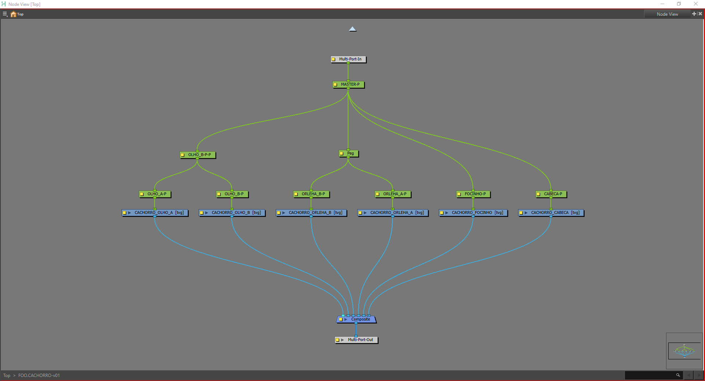
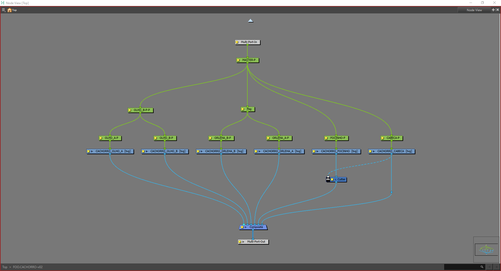

---  
sidebar_position: 1
title: "Estrutura de RIG"
description: "Uma descrição da estrutura de RIGs do BirdoApp."
---
import Tabs from '@theme/Tabs';
import TabItem from '@theme/TabItem';
import importedMasterGroup from './master-group.png'
import importedMasterBancoGroup from './master-banco-group.png'
import importedRigGroup from './rig-nodes-group.png'

Para usar as Bibliotecas do BirdoApp, é necessário utilizar algumas regras de estruturação de RIG. A ferramenta para salvar os RIGs na ["BirdoAsset"](../funcionalidades/menu/index.mdx#salvar-tpl) depende dessa estrutura para funcionar.


## Tipos de RIG
Existem dois tipos de RIGs possíveis para as Bibliotecas: 
 - **FULL**: completo com um node group MASTER de ["banco"](#grupos-de-banco) definido; 
 - **SIMPLES**: um rig com estrutura mais simples, e **SEM** um group node de banco principal. Não podendo ser salvo itens para este tipo de RIG na ["BirdoLibrary"](./birdo-library.md)
:::info
  Basicamente, o que define se um ASSET vai ser um RIG _FULL_ ou _SIMPLES_ é se será necessário criar um banco de _BirdoLibrary_ para este RIG. Por exemplo, geralmente banco de reaproveitamento do Poses, ou Animação são mais necessários para personagens. Então um Prop não  se faz necessário criar um banco de BirdoLibrary, e pode ter um RIG do tipo _SIMPLES_.
::: 
## Estrutura de Nodes
O RIG precisa seguir a seguinte estrutura de grupos:

`Top` / `{Grupo MASTER do RIG}` / `{Grupo MASTER de banco do RIG}` / `{Nodes do RIG}` 

> Para exemplificar a estrutura de um RIG, vamos usar a versão `v03` do personagem `CH001_LUPI` do projeto com prefixo `LEB`:
`Top/CH003_LUPI/LEB.LUPI-v01/...`
<Tabs>
  <TabItem value="asset_name" label="Grupo MASTER do RIG" default>
    O grupo MASTER é o primeiro groupo de node do RIG, na raiz _Top_, e geralmente é usado uma _Peg_ acima desse grupo chamada _'Stage'_ para definir o tamanho e posição inicial do Rig na cena:
    <div style={{ textAlign: 'left'}}>  </div>
    > A nomenclatura é o nome completo do ["ASSET"](./birdo-assets.md#nomenclatura-de-assets), no caso: `Ch003_LUPI` 
  </TabItem>
  <TabItem value="master_banco" label="Grupo MASTER de banco">
    :::info
       Este sub-grupo não é usado no tipo de RIG _SIMPLES_!
    :::
    O Grupo MASTER de ["banco"](#grupos-de-banco), é o grupo de banco principal do RIG. 
    <div style={{ textAlign: 'left'}}>  </div>
    > Este subgrupo que definie o ["RIG FULL"](#tipos-de-rig) tem como sugestão esta organização: 
     - _PEG_ 'PATH' ou 'DESLOCAMENTO' para ter uma opção de deslocamento a mais pro personagem;
     - Grupo do ["banco"](#grupos-de-banco);
     - Saídads para conexão de props do grupo de banco (opcional);
     - node de sombra (opcional);    
  </TabItem>
  <TabItem value="nodes_rig" label="Grupo de Nodes do RIG">
    Este grupo é onde fica toda estrura de nodes do RIG, com membros.
    > Exemplo de nodes de um RIG:
    <div style={{ textAlign: 'left'}}>  </div>
  </TabItem>
</Tabs>

## Grupos de Banco
Um grupo de **BANCO**, consiste em um grupo de nodes com uma nomenclatura padrão que o define como passível de banco da ["BirdoLibrary"](./birdo-library.md). Esse padrão consiste em:

`{PREFIXO do PROJETO}`.`{Nome do ASSET SEM PREFIXO}`-`{["versão do RIG no padrão v01"](#versionamento-de-rigs)}` 
> Ex: `LEB.LUPI-v03`

Todo Grupo de nodes salvo com essa nomenclatura padrão, será reconhecido como um banco da _BirdoLibrary_ e poderá ter itens salvos com a ["BD_BirdoLibSave"](../funcionalidades/toolbars/animation.md#bd_birdolibsave-bd_birdolib_save-icon)

## Versionamento de Rigs
O que define o versionamento de um ["grupo de banco"](#grupos-de-banco) de um RIG, é a estrutura de nodes dentro deste grupo. 
Todo RIG na hora que for salvo na ["BirdoASSET"](../funcionalidades/menu/index.mdx#salvar-tpl), terá registrado toda lista de nodes do grupo de banco que conter dentro dele em um arquivo `_rigINFO.v00.json` na ["estrutura"](./birdo-assets.md#estrutura) de pastas do _BirdoASSET_, e esta lista definirá sua versão. Sendo assim, o banco gerado pela BirdoLibrary somente estará disponível para aquela versão.
:::tip
   Somente crie banco da ["BirdoLibrary"](./birdo-library.md) quando já estiver na versão final e aprovada do RIG para evitar gerar banco para uma versão não mais utilizada na produção.
:::

### Exemplo de Versionamento
Exemplo prático de versionamento com um _RIG_ fictício de um personagem chamado `CACHORRO` de um projeto com prefixo `FOO`:
<Tabs>
  <TabItem value="v01" label="Versão 'v01'" default>
    Este é a estrutura de nodes do _RIG_ do _CACHORRO_, definido como 'v01', no grupo de banco `FOO.CACHORRO-v01`:
    
    Estes nodes são listados com o caminho relativo do node de grupo de banco da seguinte forma para definir a v01:
    ```json
    {
      "nodes": [
        "Composite",
        "Multi-Port-In",
        "Multi-Port-Out",
        "CACHORRO_CABECA",
        "CACHORRO_ORLEHA_A",
        "CACHORRO_ORLEHA_B",
        "CACHORRO_OLHO_A",
        "CACHORRO_OLHO_B",
        "CACHORRO_FOCINHO",
        "OLHO_A-P",
        "FOCINHO-P",
        "OLHO_B-P",
        "ORLEHA_A-P",
        "CABECA-P",
        "ORLEHA_B-P",
        "MASTER-P",
        "Peg",
        "OLHO_B-P-P"
      ]
    }
    ``` 
  </TabItem>
  <TabItem value="v02" label="Versão 'v02'">
    Digamos que foi adicionado um node _Cutter_ neste _RIG_, modificando a contagem de nodes internos do grupo de Banco. Nesse caso, o grupo de banco 'FOO.CACHORRO-v01' passa ser 'FOO.CACHORRO-v02'.
    
    A lista da versão nova, ficaria dessa forma, com o node "Cutter" adicionado:
    ```json
    {
      "nodes": [
        "Composite",
        "Multi-Port-In",
        "Multi-Port-Out",
        "CACHORRO_CABECA",
        "CACHORRO_ORLEHA_A",
        "CACHORRO_ORLEHA_B",
        "CACHORRO_OLHO_A",
        "CACHORRO_OLHO_B",
        "CACHORRO_FOCINHO",
        "OLHO_A-P",
        "FOCINHO-P",
        "OLHO_B-P",
        "ORLEHA_A-P",
        "CABECA-P",
        "ORLEHA_B-P",
        "MASTER-P",
        "Peg",
        "OLHO_B-P-P",
        "Cutter"
      ]
    }
    ``` 
  </TabItem>
</Tabs>

## Clone de Membros
Para um RIG mais eficiente, uma técnica que sugerimos usar é o _Clone_ de grupos de membros do _RIG. 

> entende-se como "grupos de membros" um grupo de nodes de braço, ou pernas por exemplo!

Essa técnica se baseia em estruturar os membros do _RIG_ (como braços e pernas) em grupos, e clonar o membro oposto com a opção "Clone Drawings Olny" do Harmony, e reposicionar o grupo clonado usando o node "_Static-Transformation_";


## Node FULL
Uma sugestão para estrutura de RIGs é, além de separar os membros em grupos, adicionar um node que convencionamos em chamar de "NODE FULL".
Basicamente, se trata de um node vazio, para ser usado como alternativa de animação full, somente para o membro do RIG em situações que faça sentido, em quantos frames julgar necessário. 

> Exemplo de uso: Criar um frame de "_smear_" de um braço, você pode usar o node FULL para desenhar tudo mais simples em uma única camada, em vez de precisar fazer individualmente por peças do RIG do braço.


:::tip
   Uma sugestão é usar o parametro "" nas propriedades do node drawing FULL, como "". Isso vai forçar o _pivot_ da peg variar conforme o desenho do node FULL! 
:::