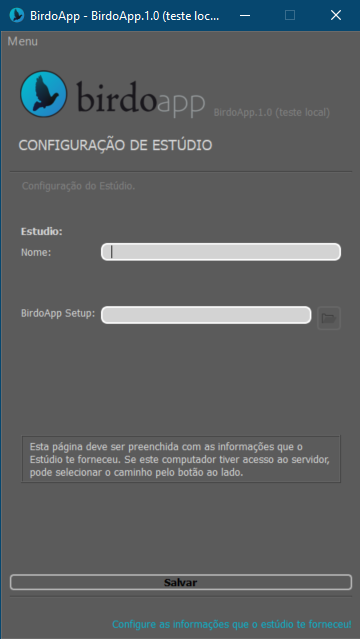

---  
sidebar_position: 6
title: "Configuração"
---

# Configuração

> _Entenda as configurações necessárias para o BirdoApp funcionar._

O BirdoApp precisa de algumas configurações para funcionar da forma esperada. Na prática essas configurações são pequenos arquivos de texto, escritos no formato `json`, que guardam informações que o BirdoApp precisa consultar durante seu funcionamento.

Basicamente são 3 configurações necessárias, dependendo do [modo de uso](./modos-de-uso) utilizado ou da função que você estiver exercendo no projeto. A seguir a explicação de cada uma delas.

## Configuração de usuário

Essa configuração é necessária para todas as pessoas que utilizarem o **BirdoApp**, mas se você for trabalhar no [modo solo](./modos-de-uso#modo-solo), isso é, sem ser em um projeto de um estúdio, então essa é a unica configuração que você precisa fazer.

Essa configuração acontece na primeira vez que você abre o BirdoApp. Na interface você vai precisar preencher dois campos:

> Interface da configuração de usuário:

* `Nome`: Seu nome de usuário.
* `Versão do Harmony`: A versão de Toon Boom instalada no seu computador que irá utilizar com o BirdoApp.

:::info
   Caso a versão de _Harmony_ que você deseja usar com o **BirdoApp** não aparecer na lista do campo `Versão do Harmony`, significa que ela está instalada em um 
   diretório não padrão. Forneça o caminho da instalação no campo `Harmony Folder` (caminho onde está o arquivo _HarmonyPremium.exe_)
:::

Essas informações serão salvas no arquivo `config.json`, na pasta do BirdoApp.

:::tip
   Evite ["caracteres inválidos"](./terminologia.md#caracteres-inválidos) ou espaços ao escolher o nome de usuário, evitando assim problemas de funcionamento do BirdoApp!
:::

## Configuração de estúdio

Se você estiver trabalhando para um estúdio, além das informações da [configuração de usuário](#configuração-de-usuário), você vai precisar preencher adicionalmente algumas informações que o estúdio 
que você trabalhar deve te fornecer:

> Interface de Configuração de Estúdio:

* `Nome do estúdio`: Nome do estúdio que você está configurando.
* `BirdoApp Setup`: É o caminho da pasta no servidor, informado pelo estúdio, onde estão configurações de projeto.

Essas informações também ficarão guardadas no arquivo `config.json`.

## Configuração Local de projeto

Ao acessar o projeto pela primeira vez, você precisará fornecer a configuração local do projeto. Basicamente, dizer pro **BirdoApp** onde na sua máquina você deseja
salvar os arquivos locais do projeto.

> Interface da Configuração Local do Projeto Selecionado

* `Folder Local`: O caminho de uma pasta **no seu computador** onde o **BirdoApp** vai manter os arquivos em que você irá trabalhar (cenas, rigs, assets...).
* `Função no Projeto`: Escolha qual a função você irá exercer no projeto;

Essas informações do projeto serão salvas na lista `user_projects` do arquivo `config.json`.

## Menu Principal

No menu superior da interface do BirdoApp, é possível ir para as páginas de configuração a qualquer momento, e editar as informações caso necessário.

As seguintes opções estão disponíveis no menu superior:

 * [***Configuração do BirdoApp***](#configuração-de-usuário): Vai para pagina de configuração básica do BirdoApp;
 * [***Configuração de Estúdio***](#configuração-de-estudio): Vai para página de configuração de Estúdio;
 * [***Configuração de Projeto***](#configuração-local-de-projeto): Vai para página de configuração local do Projeto;
 * **Créditos**: Mostra créditos do BirdoApp em uma janela;
 * **Termos Legais**: Mostra os Termos Legais do BirdoApp;
 * **Exit**: Fecha o programa;

:::info
   Os itens de configuração aparecem disponíveis no menu somente nas páginas correspondentes. 
:::