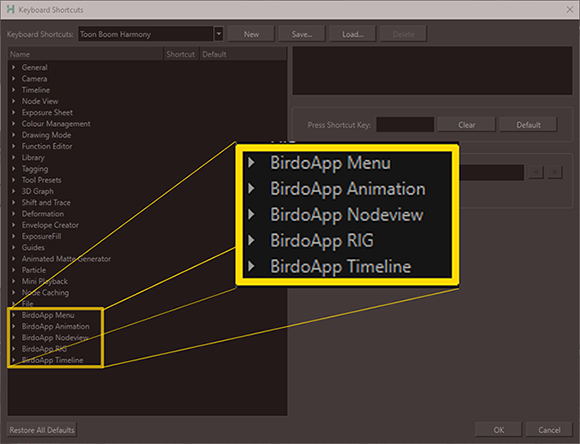

import DocCardList from '@theme/DocCardList';

As funcionalidades do BirdoApp são divididas em dois tipos:

### 1 - Ferramentas da Interface do BirdoApp:

Principais ferramentas da interface do BirdoApp:
- [Principais](./principais/index.mdx)

### 2 - Ferramentas disponíveis dentro do Harmony:
- [Menu](./menu/index.mdx)
- [ToolBars](./toolbars/index.mdx)

> Para todas ferramentas dentro do _Harmony_, é possível configurar atalhos de teclado:

  
Configurar Atalhos de Teclado

  Você pode associar atalhos do teclado a todas ferramentas do BirdoApp disponíveis dentro do Harmony.
  Se o arquivo for aberto corretamente pelo BirdoApp, as ferramentas ficarão disponíveis no menu de atalhos do Harmony:
  > _Edit \> Keyboard ShortCuts..._

  
  
  :::tip
  Associe a ferramenta [_BD\_SelectNodeUp_](./toolbars/animation.md#bd_select_up_node) ao atalho "B" substituindo a ferramenta padrão de navegação do Harmony pela mesma ferramenta turbinada do BirdoApp com   funcionalidades extras ao selecionar o parent node.
  :::

### Menu Principal

No menu superior da interface do BirdoApp, é possível ir para as páginas de configuração a qualquer momento, e editar as informações caso necessário.

As seguintes opções estão disponíveis no menu superior:

 * [***Configuração do BirdoApp***](../configuracao.md#configuração-de-usuário): Vai para pagina de configuração básica do BirdoApp;
 * [***Configuração de Estúdio***](../configuracao.md#configuração-de-estudio): Vai para página de configuração de Estúdio;
 * [***Configuração de Projeto***](../configuracao.md#configuração-local-de-projeto): Vai para página de configuração local do Projeto;
 * **Créditos**: Mostra créditos do BirdoApp em uma janela;
 * **Termos Legais**: Mostra os Termos Legais do BirdoApp;
 * **Exit**: Fecha o programa;

:::info
   Os itens de configuração aparecem disponíveis no menu somente nas páginas correspondentes. 
:::