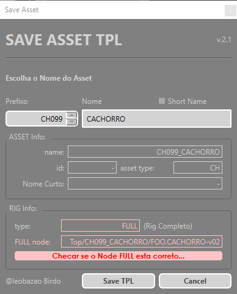

Menu superior dentro do _Harmony_ do BirdoApp com as principais ferramentas de pipeline.

### Atualizar Animatic
Atualiza o node de animatic da cena, se houver um animatic mais atual na rede.

### Renderizar
Exporta localmente os frames do arquivo para os formatos desejados.

### Publicar
Abre interface para fazer o publish do arquvio de cena,
gerando uma copia versionada e compactada na estrutura de cenas do projeto.

### Salvar tpl
Esta ferramenta abre interface com opções para salvar o _RIG_ selecionado na ["BirdoASSET"](../../bibliotecas/birdo-assets.md).
 
**Modo de uso:** Selecione o Grupo Principal do _RIG_, junto da _PEG_ _STAGE_ e o _backdrop_ do _RIG_, caso tenha.

**Avisos Sobre o RIG:** Antes de abrir a interface, o script analiza o _RIG_ selecionado.
- Verifica se há node FULL no RIG (não é obrigatório criar FULL nodes no RIG para salvar!);
- Aviso sobre exposição vazia de drawings (olhar ferramenta ["Empty to Zzero"]);
- Aviso sobre Pivot da _PEG_ _STAGE_; 
- Aviso de uso de mais de uma paletta de cor no RIG;

:::tip
   Deixe a timeline preparada para salvar o tpl do RIG. deixe exposto nela somente o turn ou as poses q deseja salvar no RIG. Limpe as paletas de cor, e organize somente com cores usadas no RIG.
:::

  
Interface

  
  - `prefixo`: Define o número de prefixo do ASSET*
  - `nome`: Define o nome do ASSET*
  - `ASSET Info`: mostra o nome completo do ASSET e informações avançadas (esta versão do BirdoApp não utuliza
  \*por padrão, o script reconhece o nome de ASSET no nome do arquivo aberto, e já inicia a interface com os valores do nome nestes campos!

  :::tip
    Deixe o mouse parado em cima do item para ver mais informações e um preview da animação caso seja item de banco de animação.
  :::

### Importar Assets
Abre interface para importar um RIG da library do projeto.

### Criar Note
Adiciona um drawing de note.
(Apenas supervisores).

### Enviar Notes
Envia note criado na cena com a ferramenta de AddNote;
(Apenas supervisores).

### Importar Notes
Baixa notes da cena atual.

### Atualizar Setup
Atualiza os elementos do setup do projeto, como lineup e nodes de informacao 
do projeto contidos no Setup base do projeto.
