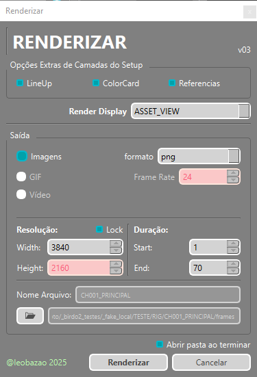
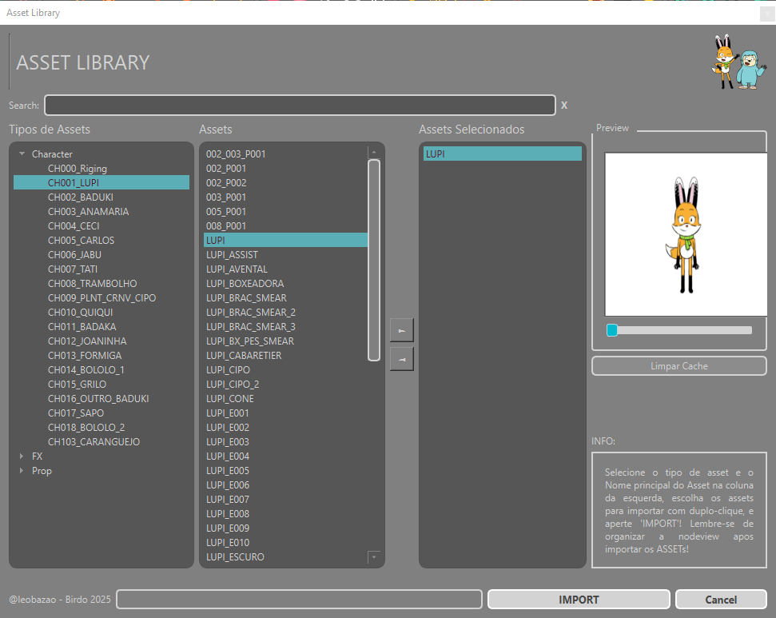
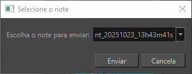
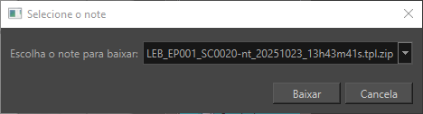

Menu superior dentro do _Harmony_ do BirdoApp com as principais ferramentas de pipeline. Neste menu, as

:::info
   Os itens do menu BirdoApp são filtrados por uma série de critérios de Modo de Uso, Tipo de Arquivo e tipo de usuários.
:::

### Disponibilidade de Ferramentas
| | _Modo Standalone_ | _Modo Estúdio_ | Arquivo CENA | Arquivo ASSET | Supervisão | Usuário Padrão |
|-|:-:|:-:|:-:|:-:|:-:|:-:|
| ["Abrir Diretório"](#abrir-diretório) | :white_check_mark: | :white_check_mark: | :white_check_mark: | :white_check_mark: | :white_check_mark: | :white_check_mark: |
| ["Renderizar"](#renderizar) | :white_check_mark: | :white_check_mark: | :white_check_mark: | :white_check_mark: | :white_check_mark: | :white_check_mark: |
| ["Publicar"](#abrir-diretório) | :x: | :white_check_mark: | :white_check_mark: | :x: | :white_check_mark: | :white_check_mark: |
| ["Salvar tpl"](#salvar-tpl) | :x: | :white_check_mark: | :x: | :white_check_mark: | :white_check_mark: | :white_check_mark: |
| ["Importar Assets"](#importar-assets) | :x: | :white_check_mark: | :white_check_mark: | :white_check_mark: | :white_check_mark: | :white_check_mark: |
| ["Criar Note"](#criar-note) | :x: | :white_check_mark: | :white_check_mark: | :x: | :white_check_mark: | :x: |
| ["Enviar Notes"](#enviar-notes) | :x: | :white_check_mark: | :white_check_mark: | :x: | :white_check_mark: | :x: |
| ["Importar Notes"](#importar-notes) | :x: | :white_check_mark: | :white_check_mark: | :x: | :white_check_mark: | :white_check_mark: |
| ["Atualizar Setup"](#atualizar-setup) | :x: | :white_check_mark: | :white_check_mark: | :white_check_mark: | :white_check_mark: | :white_check_mark: |


### Abrir Diretório
Abre o diretório do arquivo Harmony no explorer.


### Atualizar Animatic
Atualiza o node de animatic da cena, se houver um animatic mais atual na rede.

:::info
   O arquivo de animatic na estrutura do projeto, tem no padrão de nome o versionamento. Essa ferramenta se baseia nessa versão comparando com a versão do node "Animatic_v00" dentro do grupo _ANIMATIC_ do _SETUP_!
   Se a versão encontrada no animatic relativo a cena na estrutura do projeto for maior que a versão atual do node _ANIMATIC_, ele atualiza. Se não, mostra um aviso que não foi preciso atualizar.
:::


### Renderizar
Interface com opções customizadas para renderizar o arquivo.

:::info
   Esta ferramenta depende da estrutura de setup de ASSET e CENA do BirdoaApp para funcionar todas opções disponíveis.
:::

**Modo de Uso:** Escolha a opção de render na interface, e o destino da mídia de saída.

<details>
  <summary>Interface</summary>

  
  - `Opções Extras de Camadas do Setup`: Marque as camadas de SETUP que pretende habilitar ou desabilitar na saída final;
     `LineUp`: Referencia de lineup do SETUP;
     `ColorCard`: Cor de fundo do SETUP;
     `Referências`: Camada com referências do SETUP;
  - `Saída`: Define tipo de saída de mídia:
     `Imagens`: define como sequência de imagens (habilita a opção para escolher formato de imagem);
     `GIF`: define saída como GIF animado. (Habilita opção de frame rate);
     `Vídeo`: define saída como vídeo no formato `.mov`;
  `Start - End`: define intervalo de frames do arquivo para exportar \*
  `Folder`: escolha o destino das mídias;
  `Nome Arquivo`: define nome de saída do arquivo (sem formato)
  `Render Display`: Define o _display_ do arquivo para renderizar;

  \*Para a opção `GIF`, esta opção de intervalo de frames não funciona corretamente nesta versão do BirdoaApp!

  :::tip
    Use a pasta 'frames' no folder do arquivo para organizar suas mídias!
  :::
</details>


### Publicar
Esta ferramenta envia uma cópia _.zip_ da cena compatada e versionada para o servidor do projeto, ficando disponível para todos usuários.

> O _PUBLISH_ respeita a ["etapa"](../../terminologia.md#etapa) em que o arquivo foi aberto, e cada etapa tem um diretório próprio para armazenar e versionar os arquivos.

:::info
   O ["Abrir Cena"](../principais/abrir-cena.md) abre o arquivo considerando a ETAPA baseada pelo tipo de usuário. Ex
   ```
   Usuário de SETUP -> ETAPA SETUP
   Usuários de animação e COMP (ANIM, ANIM_LEAD, COMP) -> ETAPA ANIM\*
   ```
   \*No caso da etapa COMP, é considerado o mesmos arquivos do diretório da etapa animação para facilitar o processo de _retake_!
:::

:::warning
   O perfil de usuário de DT (direção técnica) permite escolher em qual etapa pretende enviar o arquivo com o publish, e se deseja adicionar o arquivo pra fila da _renderfarm_ caso haja uma configurada!
:::

### Salvar tpl
Esta ferramenta abre interface com opções para salvar o _RIG_ selecionado na ["BirdoASSET"](../../bibliotecas/birdo-assets.md).
 
**Modo de uso:** Selecione o Grupo Principal do _RIG_, junto da _PEG_ _STAGE_ e o _backdrop_ do _RIG_, caso tenha.

**Avisos Sobre o RIG:** Antes de abrir a interface, o script analiza o _RIG_ selecionado.
- Verifica se há node FULL no RIG (não é obrigatório criar FULL nodes no RIG para salvar!);
- Aviso sobre exposição vazia de drawings (olhar ferramenta ["Empty to Zzero"]);
- Aviso sobre Pivot da _PEG_ _STAGE_; 
- Aviso de uso de mais de uma paletta de cor no RIG;

:::tip
   Deixe a timeline preparada para salvar o tpl do RIG. deixe exposto nela somente o turn ou as poses q deseja salvar no RIG. Limpe as paletas de cor, e organize somente com cores usadas no RIG.
:::

<details>
  <summary>Interface</summary>

  
  - `prefixo`: Define o número de prefixo do ASSET*
  - `nome`: Define o nome do ASSET*
  - `ASSET Info`: mostra o nome completo do ASSET e informações avançadas (esta versão do BirdoApp não utuliza
  \*por padrão, o script reconhece o nome de ASSET no nome do arquivo aberto, e já inicia a interface com os valores do nome nestes campos!

  :::tip
    Deixe o mouse parado em cima do item para ver mais informações e um preview da animação caso seja item de banco de animação.
  :::
</details>


### Importar Assets
Abre uma interface para navegar na ["BirdoASSET"](../../bibliotecas/birdo-assets.md) e escolher assets da biblioteca de RIGs do projeto e importar diretamente pro arquivo.assets

:::info
   Ao ser importado para o arquivo, os itens selecionados são importados e jogados soltos na _Node View_ e ainda precisam ser conectados e organizados corretamente!
:::

**Modo de Uso**: Selecione os itens pela interface com duplo clique, ou com o botão "►", e aperte 'IMPORT'.

<details>
  <summary>Interface</summary>

  
  - `Search`: campo de busca de assets por nome;
  - `Tipos de Assets`: Escolha nesta lista o asset filtrado por ["tipo de asset"](../../bibliotecas/birdo-assets.md#tipos-de-assets);
  - `Assets`: Escolha o sub-item do asset escolhido. Há duas formas de selecionar um item aqui:
     * `Duplo Clique`: Clique duas vezes em um item para enviar ele para a lista de selecionados;
     * `Botão "►"`: Selecione um item desta lista e clique no botão "►" para jogar o item para lista de selecionados;
  - `Assets Selecionados`: Aqui, ficam listados os itens selecionados para importar;
  - `Preview`: Mostra um preview do item selecionado;
  - `Clear Cache`: Limpa os arquivos temporários que o script usa para mostrar o preview;

</details>


### Criar Note
Adiciona um novo _node_ de Note no grupo "_NOTES_", e seleciona o _node_ criado para ser usado pra criar o note.

:::info
   O padrão de nome do _node_ criado é `nt_{ano}{mes}{dia}_00h00m00s` usando o hoário e data que foi criado.
:::


### Enviar Notes
Seleciona um _node_ de note existente no grupo "_NOTES_" para ser enviado para o servidor do projeto e ficar disponível para todos usuários.

**Modo de Uso**: Selecione um _node_ na interface e clique em enviar;

:::info
   Os _nodes_ de note existentes no grupo _NOTES_ são listados na interface:

   
:::


### Importar Notes
Seleciona note da CENA do servidor, para importar direto pra CENA.

**Modo de Uso**: Selecione um note na interface e clique em 'baixar';

:::info
   Os notes existentes da cena serão listados na interface:

   

   OBS: Os notes são importados diretamente para o grupo _NOTES_!
:::


### Atualizar Setup
Atualiza os elementos do SETUP do projeto, como lineup e nodes de informação do projeto contidos no Setup base do projeto.

:::info
   O arquivo template de SETUP, tanto de CENA quanto de ASSET pode ser atualizado na pasta de configuração do projeto, e os elementos modificados serão atualizados com essa ferramenta!
:::