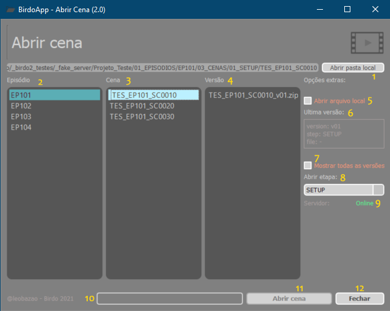

---  
sidebar_position: 1  
title: "Abrir Cena"
---
import importedLogo from './abrir-cena-icon.png'

# 
  
 ABRIR CENA 
Interface do BirdoApp inicializadora de cenas de um projeto. Aqui são listadas todas cenas disponíveis na estrutura de servidor do projeto, onde o usuário pode escolher a versão da cena, e abrir localmente uma cópia para trabalhar.

1. Abre a do servidor da cena selecionada;
2. Seleciona o Episódio;
3. Seleciona a cena do Episódio;
4. Seleciona a Versão da cena;
5. Se já houver uma versão local da cena, marque esta opção para abrir esta versão local;
6. Lista informações da cena selecionada;
7. Mostra todas versões disponíveis da cena;
8. Selecionar setup para abrir a cena (apenas disponível para o user DT);
9. Status do servidor;
10. Barra de Progresso com informações das ações;
11. Botão para abrir cena selecionada;
12. Fechar interface;
