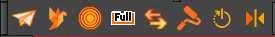
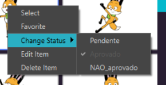
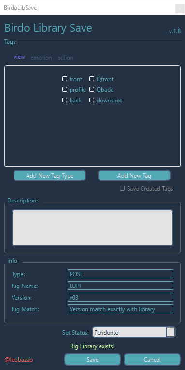
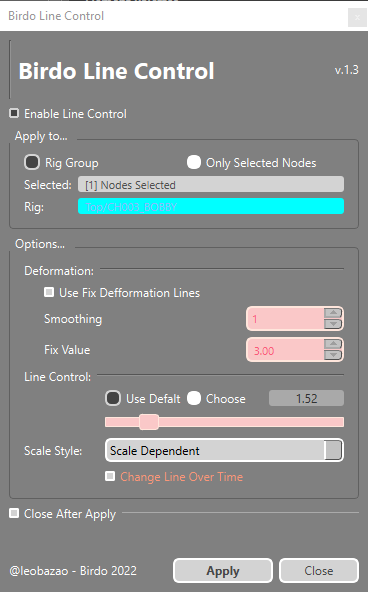
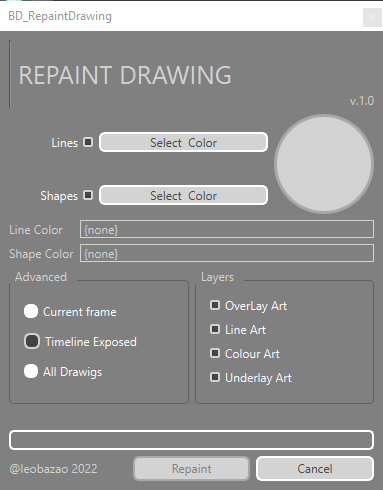
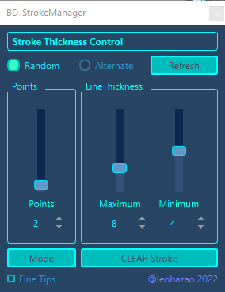

---  
sidebar_position: 2
title: "BirdoApp Animation"
description: "Toolbar dedicado as ferramentas de animação."
---
import importedSelDown from './animation/BD_SelectNodeDown.gif'
import importedSelUp from './animation/BD_SelectNodeUp.gif'
import importedBD_Mirror from './animation/BD_Mirror.gif'
import importedBD_ResetSpecial from './animation/BD_ResetSpecial.gif'
import importedIterfaceBirdoLib from './animation/BirdoLib-interface.png'

:::tip
Adicione a barra **BirdoApp Animation** a janela _Camera View_ para melhor acessar essas ferramentas na hora do uso
::: 

### BD_BirdoLibrary 
Esta ferramenta acessa o banco de reaproveitamento da [_BirdoLibrary_](../../bibliotecas/birdo-library.md) e permite aplicar o banco escolhido no frame atual do RIG selecionado.

**Modo de Uso**: Selecionar qualquer node do RIG, e apertar o botão.

  
Interface

  
  

   1. Itens do Banco do Rig selecionado. Cada Rig pode conter mais de um grupo de banco. Os grupos de bancos são divididos por abas nessa área. Nesse exemplo, temos somente o grupo principal do Rig "LUPI";
   2. "_Right to Modify_": marque esta opção para liberar a edição dos itens (somente disponível para perfis de supervisão);
   3. "Filter": existem opções para filtrar os itens do banco de dados por:
   - "_type_": que define o tipo de item, como animação ou pose;
   - "_Status_": que permite filtrar de acordo com a situação do item, seja aprovado ou aguardando aprovação;
   - "_Tags_": onde é possível adicionar diferentes palavras-chave para refinar ainda mais a busca;

   4. "_Advanced_": Esta área oferece opções avançadas para aplicação do banco:
   - "_Keys Drawings_": aplica tanto _keys_ quanto _drawings_ na timeline;
   - "_Only Drawings_": aplica somente _drawings_ na timeline;
   - "_Only Keys_": aplica somente _keys_ na timeline;
   - "_Frames_": dá opção de aplicar intervalo de frames dentro da animação do item (somente abilitado para itens de banco de animação);
   
   5. "_Rig Path_": Caminho de destino do RIG selecionado;	
  
  :::tip
  Mantenha o cursor parado sobre um item para acessar detalhes adicionais e uma visualização prévia da animação, se for um item do banco de animação
  :::

  
Avançado

  Ao clicar com botão direito do mouse em um item, as seguintes opções estarão disponíves:

  

  - `Select`: Seleciona o item (o mesmo que clicar direto no item);
  - `Favorite`: Seleciona o item como favorito. Fica marcado com uma linha amarela em volta do item; 
  - \*`Change Status`: Muda o status para um dos disponíveis;  
  - \*`Edit Item`: Abre o tpl do item para edição;
  - \*`Delete Item`: deleta o item selecionado do banco da BirdoLibrary;

  \*Disponível apenas para tipos de usuários com permissão de edição;

### BD_BirdoLibSave 
Esta ferramenta seleciona uma POSE ou ANIMAÇÃO na timeline do grupo de banco do RIG e salva na [_BirdoLibrary_](../../bibliotecas/birdo-library.md).

**POSE:** Fica definido como POSE toda seleção do grupo de banco do RIG na _timeline_ que contenha **APENAS** 1 frame;
**ANIMAÇÃO**: Fica definido como ANIMAÇÃO toda seleção do grupo de banco do RIG na _timeline_ que contenha **MAIS** de 1 frame;

**Modo de Uso:** Selecione o grupo de banco do RIG que deseja salvar, e quantos frames do banco que deseja salvar.

  
Interface

  
  

  - `Tags`: Aqui é listado todas tags disponíveis da BirdoLibrary para adicionar no item. Dividida por tipos em Abas
  - \*`Add New Tag Type`: Cria um novo tipo de Tag e uma aba nova;
  - \*`Add New Tag`: Cria nova Tag na aba de Tag atual;
  - `Description`: Adicione um texto com descrição para o item salvo;
  - `Info`: Campo com resumo de informações do RIG selecionado para salvar novo item de banco;
  - \*`Set Status`: Define o status do item no ato de salvar;
  
  \*Disponível somente para usuários com permissão para edição de itens da BirdoLibrary!    
  

### BD_BirdoLineControl 
Ferramenta para controlar a linha do RIG ou drawing selecionado.

**Modo de uso:** Selecione um node do RIG, e escolha no campo `Apply To` se deseja aplicar os valores a todo RIG ou apenas aos nodes selecionados.

:::info
   Esta ferramenta é facilitador de seleção de nodes de drawings para ativar os parâmetros de "Line Thickness" dos nodes de _Drawings_ do _Harmony.
:::
:::tip
De preferencia usar depois da animacao ja aprovada, e com movimentos de camera definidos!
:::

  
Interface

  
  

  - `Enable Line Control`: Este checkbox define se será usado a modulação de linha do harmony (ativa o parametro "Adjust Pencil Line Thickness" da aba "Line Thickness" de parametro de node de drawing). 
  - `Apply To`: Estas opções definem as opções de seleção: aplica ao `Rig Group` ou apenas os nodes selecionados: `Only Selected Nodes`;
  - `Options`: Define os valores de "Line Thickness";
   1. `Deformation`: Define os valores de "Line Thickness" para deformers;
   2. `Line Control`: Define se vai usar um valor padrão calculado (`Use Defalt`) ou se pretende escolher um valor manualmente (`Choose`);
   3. `Scale Style`: Modifica os valores do parâmetro "Scale Independent" do "Line Thickness" do node _Drawing_;
  - `Close After Apply`: Fecha a interface depois de aplicar os valores;

### BD_FULLAnimation 
Ferramenta para posar um mebro específico do *_RIG_ desenhando todas peças em somente um drawing.

**Modo de uso:**
- selecione o drawing do membro que deseja desenhar no FULL;
- aperte normal: ira jogar todos drawings do membro para o Zzero e selecionar o FULL pra vc.
- aperte com shift pressionado: seleciona o node FULL sem zerar os outros desenhos. 

***A estrutura do _RIG_ tem que ter o node _FULL_ montado no membro corretamente para funcionar.**

### BD_Mirror 
Ferramenta para copiar a pose do membro selecionado para o membro oposto
**Modo de Uso**: Selecione qualquer peça de um membro do RIG (braçou ou perna) para copiar a pose do membro selecionado para o membro oposto.

:::warning
   Esta ferramenta depende de uma estrutura de RIG de _clone_ de membros! Aprenda mais sobre ["aqui"](../../bibliotecas/rig#clone-de-membros);
:::

  

### BD_RepaintDrawing 
Ferramenta para REPINTAR as as linhas e shapes de todos drawings do node selecionado.

**Modo de Uso:** Selecione um node de drawing e defina os parametrôs na interface.

  
Interface

  
  

  - `Lines`: Este checkbox habilita a escolha de cor para todas "Lines" dos _drawings_; 
  - `Shapes`: Este _checkbox_ habilita a escolhga de cor dos preenchimentos do _drawing_;
  - `Select Color`: Define a cor de cada parte;
  - `Advanced`: escolhe quais drawings deverão ser afetados pelas opções de cor escolhidas;
   1. `Current Frame`: Apenas o drawing do frame atual;
   2. `Timeline Exposed`: Apenas os drawings expostos da _Timeline_;
   3. `All Drawings`: Todos _drawings_ do node selecionado;
  - `Layers`: Seleciona quais "_layers-arts_" para repintar os drawings; 

### BD_ResetSpecial 
Esta ferramenta é uma opção mais avançada do _reset Transformation_ padrão do _Harmony_:
- _Reset_ do node _Drawing_ caso ele tenha _keyframes_;
- _Reset_ do Deform acima do node _Drawing_, caso exista;
- _Reset da _PEG_ acima do node _Drawing_ selecionado;

**Mode de Uso:** Selecione o node de drawing, e aperte o botão. Para _resetar_ o grupo inteiro do node selecionado, pressione _shift_ ao apertar o botão!
Pressione "Shift" e reseta o grupo inteiro.

  

### BD_StrokeThicknessControl 
Ferramenta de drawing, para editar a espessura da linha criando pontos de modulação de drawing na _line_ selecionada. 
conforme configurado na interface.

**Modo de Uso:** Selecione com a ferramenta de seleção de _drawing_ a parte do desenho que pretente editar as _lines_ do desenho.

:::info
   Os pontos de modulação de linhas aqui citados, são os mesmo pontos criados e editados com a ferramenta _"Pencil Editor"_ do _Harmony_
:::

  
Interface

  
  

  - `Random`: Marca o modo aleatório para criação dos pontos de modulação de _line_; 
  - `Alternate`: Muda para o modo alternado da criação de pontos. Determinando espaçamento iqual entre os pontos;
  - `Refresh`: Aplica os valores definidos;
  - `Points`: define o número de pontos a serem criados na line selecionada;
  - `LineThickness`: define o valor máximo e minimo dos pontos de modulação; 
  - `Mode`: Muda o modo de aplicação dos pontos: `Points` cria o número exato de pontos definidos, `Length` cria pontos baseados no tamanho da distancia dado e varia no número final de pontos dependendo do comprimento da _line_ selecionada;
  - `CLEAR Stroke`: Limpa todos os pontos de modulação de espessura da _line_;
  - `Fine Tips`: Força um afinamento das _lines_ nos ultimos pontos dela;
  

### BD_Select_Up_Node
Navega na estrutura de nodes subindo na hierarquia e selecionando o parent node da seleção com as seguintes características: 
- Ignora grupos;
- Ignora Node de Static-Transformation;
- Mostra o deform no caminho da hierarquia se houver;
:::tip
Substitua o atalho 'B' por esta ferramenta, e navegue pelos nodes com mais opções.
:::

  

### BD_Select_Down_Node
Navega na estrutura de nodes descendo na hierarquia com as mesmas funcionalidades do [_BD_Select_Up_Node_](#bd_select_up_node)
:::tip
Substitua o atalho 'V' por esta ferramenta, e navegue pelos nodes com mais opções.
:::

  

