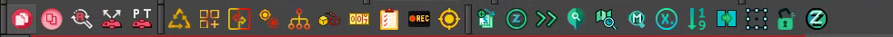

import DocCardList from '@theme/DocCardList';
import importedGif from './animation/Toolbar_Animation3.gif'

Estas são as ferramentas que se encontram disponíveis nas barras de toolbars do _Harmony_. Por padrão, elas iniciam todas na barra superior.

> _todas toolbars alinhadas na barra superior_

<DocCardList />

:::tip
É possível customizar cada toolbar em diferentes _views_ do _Harmony_ para melhor acessar durante o uso. Basta clicar com o botão direito do mouse na barra de ferramentas de qualquer view, e selecionar o toolbar que faça sentido para cada _view_.
> Exemplo: BirdoApp Animation na _camera view_

  

:::