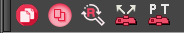
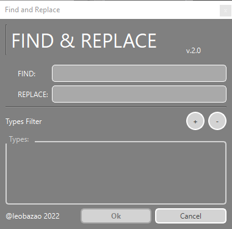
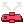
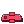

---  
sidebar_position: 3
title: "BirdoApp NodeView"
description: "Toolbar dedicado as ferramentas de uso na _NodeView_."
---
import importedExAntes from './nodeview/BD_OrganizarNodeView-EX_ANTES.png'
import importedExDepois from './nodeview/BD_OrganizarNodeView-EX_DEPOIS.png'

:::tip
Adicione a barra **BirdoApp Node View** a janela _Node View_ para melhor acessar essas ferramentas na hora do uso!
::: 

### BD_CloneModule 
Esta ferramenta é um atalho para a opção do menu da _Node View_ `||| > Nodes > Clone Selected Nodes: Drawings Only` que clona os nodes selecionados com a opção 'Drawings Only'.

**Modo de Uso**: Selecionar qualquer node e apertar o botão.

:::info
   Clonar nodes com a opção 'Drawings Only' é equivalente a criar cópias com _timming_ independentes dos nodes, mas com mesmas colunas de _drawings_!
   Ou seja: é possível animar a troca de desenhos independentes, mas eles compartilham o mesmo banco de desenho. 
:::

### BD_DuplicateModule 
Esta ferramenta é um atalho para a opção do menu da _Node View_ `||| > Nodes > Duplicate Selected Nodes` que duplica os nodes selecionados.

**Modo de Uso**: Selecionar qualquer node e apertar o botão.

:::info
   Duplicar nodes é equivalente a criar cópias completamente independentes destes nodes!
:::

### BD_FindAndReplace 
Ferramenta para renomear nodes buscando o texto fornecido em todos nodes e sub-nodes selecionados. 

**Modo de uso:** Selecione nodes, incluindo grupos, escolha termo para achar, e termo para substituir!

:::tip
   Inclua os filtros de tipo de node para um rename avançado. Exemplo: mudar palavras chaves APENAS nas _Pegs_ de um grupo!
:::

  
Interface

  
  
  - `FIND` Digite aqui o texto da palavra chave para procurar dentro da seleção de nodes; 
  - `REPLACE` Digite aqui o texto para SUBSTITUIR todos nodes que forem encontrados o termo em `FIND`;
  - `Types Filter` Clique em `+` para adicionar um novo filtro, e `-` para remover um filtro existente;
  - `Types` Cada filtro gera um _ComboBox_ novo com todos tipos de nodes encontrados na seleção; 

### BD_OrganizarNodeView 
Esta ferramenta organiza os node acima da _Composite_ selecionada.

**Modo de uso:** Selecione um node _Composite_ e aperte o botão, os nodes serão organizados para cima em forma de pirâmide.

#### Exemplo de uso:
> ANTES  
  

> DEPOIS    
  

:::warning
   Algumas estruturas de conexões de nodes mais complexas pode afetar o funcionamento desta ferramenta! 
:::

### BD_SetPassTrough 
Esta ferramenta muda o modo das _Composites_ selecionadas para o modo _PassThrough_.

**Modo de Uso**: Selecione um ou mais nodes de _Composite_ e aperte o botão

