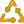
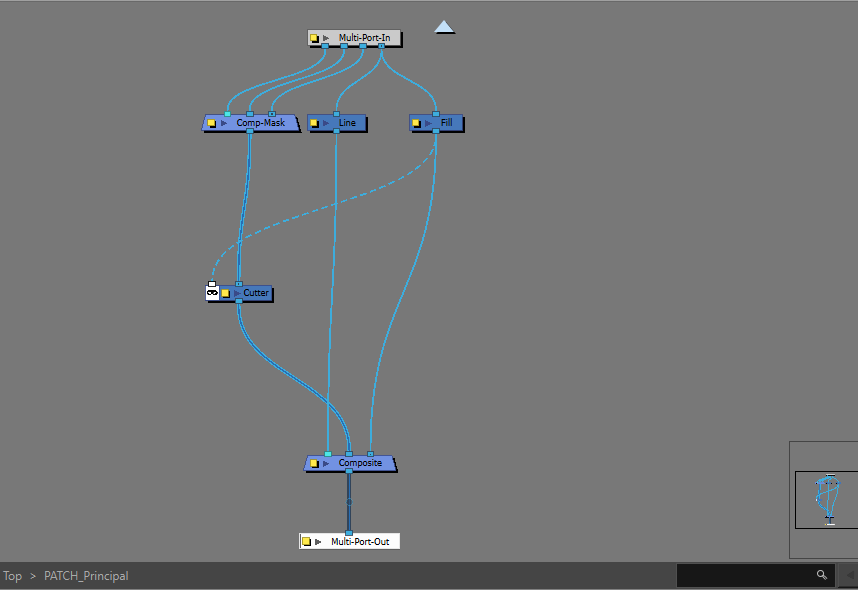
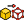
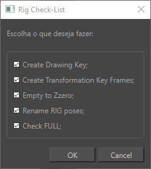

---  
sidebar_position: 5
title: "BirdoApp Rig"
description: "Toolbar dedicado as ferramentas de uso para confecção de RIGs."
---
import Tabs from '@theme/Tabs';
import TabItem from '@theme/TabItem';
import importedFindMP_GIF from './timeline/BD_FindMasterPeg.gif'
import importedFindExpInterface from './timeline/BD_FindDrawingExp-interface.png'
import importedFindColourInterface from './timeline/BD_FindDrawingWithColour-interface.png'

:::tip
Adicione a barra **BirdoApp Rig** a janela _Node View_ para melhor acessar essas ferramentas na hora do uso!
::: 

### BD_3DPathToSeparate 
Esta ferramenta serve para mudar o modo '_Position_' das pegs em um RIG. 

**Modo de Uso**: Selecione o grupo do RIG, e aperte o botão para mudar todas as PEGs dentro do grupo, de '_3DPath_' para '_separete_".

### BD_AddFullNodes 
Esta ferramenta serve para adicionar a estrutura padrão de _Node FULL_.

**Modo de Uso**: Aperte o botão estando dentro do grupo do membro do RIG que deseja adicionar o node FULL. Não Precisa selecionar nada. Escolha o nome do node FULL pra adicionar.

:::tip
   Para entender melhor sobre o Node Full, leia mais ["aqui"](../../bibliotecas/rig.md#node-full)!
:::

### BD_CompareGroups 
Esta ferramenta serve para comparar grupos de nodes, com informações detalhadas do conteúdo dos grupos e opções avançadas para organização.

Destre alguns casos de uso, destaca-se:
- Comparar membros clonados dentro de um RIG;
- Comparar versões de RIGs diferentes na mesma cena;
- Organizar coordenadas dos nodes na _Node View_ baseadas em outro grupo de node idêntico;

  
Interface

  > Há uma separação da interface entre o grupo A e grupo B:

  <Tabs>
    <TabItem value="initial" label="Interface Inicial" default>
      
      - `Node Group A` Seleciona o primeiro grupo para comparação (chamado de grupo A);
      - `Node Group B` Seleciona o segundo grupo para comparação (chamado de grupo B);
      - `Compare` Clique em 'compare' para criar uma lista de comparação;

    </TabItem>
    
    <TabItem value="selected" label="Interface Grupos Selecionados">
      > Os itens que existem um '_match_' com o node de outro grupo, é mostrado na cor verde, e se não encontrar um "_match_", na cor laranja.   
      
      
      - `Find Node` Seleciona o node do item da lista de nodes do lado do grupo;
      - `Copy Coordinates from B/A` Copia as coordenadas dos nodes do outro grupo; 
      - `Filters` Filtra a lista de nodes listados de cada lado por tipo de node ou por status de _match_;
      - `CLEAR` Aperte para limpar a lista de comparação criada;
   
    </TabItem>
  </Tabs>

### BD_CopyPegPivot 
Esta ferramenta serve para copiar o Pivot de uma _PEG_ para outra.

**Modo de Uso**: Siga essas duas etapas: 
 - Selecione a _PEG_ com os valores de _pivot_ que deseja copiar e pressione o botão com a tecla 'Shift' pressionada;
 - Selecione a _PEG_ que deseja colar os valores copiados e pressione o botão;

> OBS: Uma mensagem _popup_ temporária informa que foi copiado e colado os valores! 

### BD_CreatePatch 
Esta ferramenta é usada para criar um _patch_ de RIG, que consiste em separar as camadas de uma forma organizada para criar uma máscara com elementos com opções avançadas.

**Modo de Uso**: Selecione os nodes envolvidos com o node principal mais a direita na _Node View_, e escolha o modo na interface.

> EX: neste cenário, vamos criar uma máscara para os node com círculos: drawing1, drawing2 e drawing3 dentro do node Principal, que é um quadrado:
<Tabs>
 <TabItem value="initial" label="Antes" default>
   
    
 </TabItem>
 
 <TabItem value="after" label="Depois"> 
   

 </TabItem>
 <TabItem value="group" label="Patch Group"> 
   
   - `Line` A linha é conectada a frente do itens mascarados;
   - `Fill` O preenchimento é conectado atrás dos itens mascarados;
 </TabItem>
</Tabs>

- `Path Name` Escolha o nome do grupo de _patch_ a ser criado;
- `Main Node` Escolha o node principal, da seleção de nodes;
- `Tipo de Patch` Seleciona o tipo de patch para usar de máscara:
   * `Layer Filter` Usa a layer _Colour-Art_ de máscara;
   * `Color-Selector` Usa um _colour-selector_ para selecionar a cor de preenchimento do drawing, não necessitando separar o drawing por camadas;
    

### BD_CreateRIGTemplate 
Esta ferramenta cria uma cópia de estrutura do grupo de RIG selecionado, com drawings vazios e idenpendentes, e com a mesma estrutura do Rig selecionado.

**Modo de Uso**: Selecione o node de grupo do RIG, e escolha o nome do template a ser criado!

### BD_NodesCounter 
Esta ferramenta conta os nodes dentro de um grupo.

**Modo de Uso**: Selecione um node de grupo e aperte.

  
Interface

  
  - `Group Node`Caminho do Node selecionado;
  - `TOTAL NODES` Número total de nodes dentro do grupo;
  - `Types Counter` Marque esta _checkbox_ para ver mais detalhes da lista de nodes, separados por tipo de node;
  

### BD_RecordActions 
Esta ferramenta grava as ações das modificações na _Node View_ e gera um arquivo de script, podendo ser rodado.

**Modo de Uso**: Aperte _REC_ para gerar um novo script, que vai registrar todas mudanças da _Node View_ e registrar a sequencia das ações em um novo script.

  
Interface

  
  - `REC` Começa uma nova gravação;
  - `Logs` Registra ações gravadas;  
  - `Play Actions` Seleciona os scripts existentes para rodar apertando o botão `Play`;
  

### BD_RIGCheckList 
Esta ferramenta serve para fazer um _checklist_ para finalizar um RIG. Conferindo na _timeline_ as poses do TURN do RIG, e conferindo aspéctos técnicos do RIG.

**Modo de Uso**: Selecione na timeline, todos os _keyframes_ do _TURN_ do RIG e marque as ações que pretende rodar:

#### Lista de Verificações:

- `Create Drawing Key` Cria key frames de drawings em todos nodes drawings do rig, em todas poses do _TURN_;
- `Create Transformation Key Frames` Cria keyframes de transformação em todas PEGs do RIG;  
- `Empty to Zzero` Muda as exposições vazias dentro do _TURN_, para o drawing "Zzero" (mesa coisa que a ferramenta ["Bd_EmptytoZzero"](./timeline.md#bd_emptytozzero-bd_emptytozzeropng-icon));
- `Rename RIG poses` Esta opção renomeia os drawings com prefixo respeitando a ordem alfabetica das poses: Primeira pose = A, segunda = B e assim por diante;
- `Check FULL` Esta opção garante os parâmetros corretos dos nodes FULL dentro do RIG;

### BD_SetPivotToPeg 
Esta ferramenta serve para mudar o pivot da peg acima de um node drawing, centralizando no meio do desenho do frame atual.

**Modo de Uso**: Selecione o drawing node, e aperte. A peg sera selecionada ao término, e com o pivot centralizado com o desenho exposto naquele frame.
