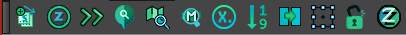
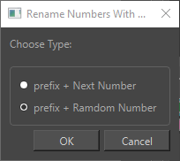
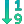
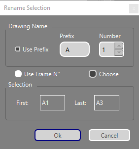
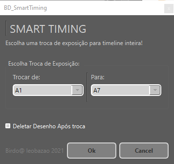
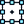
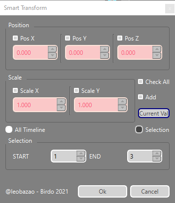

---  
sidebar_position: 4
title: "BirdoApp Timeline"
description: "Toolbar dedicado as ferramentas de uso na Timeline."
---
import importedFindMP_GIF from './timeline/BD_FindMasterPeg.gif'
import importedFindExpInterface from './timeline/BD_FindDrawingExp-interface.png'
import importedFindColourInterface from './timeline/BD_FindDrawingWithColour-interface.png'




:::tip
Adicione a barra **BirdoApp Timeline** a janela _Timeline View_ para melhor acessar essas ferramentas na hora do uso
::: 


### BD_DuplicateDrawingSpecial 
Esta ferramenta é uma versão avançada do _Duplicate Drawing_ do _Harmony_. Criando um drawing duplicado com nome personalizado, e único.

**Modo de Uso**: Selecione um drawing na timeline, e aperte o botão.

:::info
   O padrão do nome duplicado fica igual o nome inicial do drawing duplicado, com um padrão de números únicos de sufixo. Ex:
   ```
   A1  => A1_12415
   ```
   Isso garante a ordem no banco da library do desenho, e garante q não irá acontecer conflitos com reaproveitamento entre arquivos diferentes do _Harmony_!
:::


### BD_EmptyToZzero 
Esta ferramenta é feita para mudar todas as camadas de drawing com exposição vazia, para a exposição de drawing vazio a exposição ["Zzero"](../../terminologia.md#zzero).
- Funciona para todas camadas abaixo na hierarquia da camada selecionada, e num intervalo de frames na _timeline_!

**Modo de Uso**: Selecione uma camada master minimizada na _timeline_ e aperte o botão.


### BD_ExposeAll 
Esta ferramenta serve para expor os drawings da camada selecionada de forma consecutiva na _timeline_ a partir do frame atual.
Existem dois tipos de uso desta ferramenta: Simples e Avançado. 

#### SIMPLES: Expõe a ordem SOMENTE dos drawings com o mesmo prefixo a atual exposição.
> Exemplo de uso simples:
```
Drawing com o banco de desenhos: 'A1, A2, A3, A4, B1, B2, B3, B4'
Exposição sequencial dos drawings a partir do frame com o drawing 'A3' ficaria: 'A1, A2, A3, A4'
```
**Modo de Uso Simples**: Selecione a camada de drawing na timeline com algum drawing exposto, e aperte o botão.

#### AVANÇADO: Expõe a ordem de TODOS drawings do banco.
> Exemplo de uso Avançado:
```
Drawing com o banco de desenhos: 'A1, A2, A3, A4, B1, B2, B3, B4'
Exposição sequencial de todos drawings a partir do frame atual ficaria: 'A1, A2, A3, A4, B1, B2, B3, B4' 
```
**Modo de Uso Avançado**: Selecione a camada de drawing na timeline com algum drawing exposto, e aperte o botão pressionando '_Shift_.


### BD_FindDrawingExp 
Esta ferramenta serve para achar na timeline em qual frame o desenho do banco escolhido de um _node drawing_ está exposto.

**Modo de Uso**: Selecione um node drawing, e aperte o botão e esolha na interface, o drawing do banco para procurar.

<details>
  <summary>Interface</summary>
  <div style={{ textAlign: 'left'}}>  </div>
   - `Thumbnail` Mostra um thumbnail dos drawings do banco de drawing do node selecionado;
   - `Slider` Escolhe o drawing do banco para procurar;
   - `Find` Roda a ferramenta com o drawing do banco selecionado;
</details>


### BD_FindDrawingWithColour 
Esta ferramenta serve para encontrar a cor selecionada em todos os drawings da cena.

**Modo de Uso**: Selecione a cor que deseja pesquisar, e aperte o botão. A interface mostra quais nodes contém a cor, e dá  chance de selecioná-los.

<details>
  <summary>Interface</summary>
  <div style={{ textAlign: 'left'}}>  </div>
   - `Node` Mostra informações dos nodes encontrados que usam a cor:
     * `Nodes With Colour` Conta quantos nodes foram encontrados com a cor selecionada;
     * `Color` Nome da cor encontrada (valor da cor na cor da fonte!)
     *  `Inde - Nome` Index e nome do node da lista encontrada;
   - `Drawing` Mostra o banco de drawing do node selecionado da lista, com _thumbnail_ e slider para escolher o desenho;
   - `Edit Drawing` Seleciona o node e muda o frame atual para a exposição escolhida do banco, e muda a para ferramenta de edição de desenho;
</details>


### BD_FindMasterPeg 
Esta ferramenta serve para selecionar do node "MASTER-PEG" pulando da seleção de qualquer node do RIG, direto para _MASTER_.

**Modo de Uso**: Selecione qualquer node do RIG e aperte o botão, ou use com atalho.

:::tip
   Escolha um atalho para esta ferramenta, pois facilita a navegação do RIG.
   Sugestão: use o atalho "Shift + B" para esta ferramenta!
:::

<div style={{ textAlign: 'left'}}>  </div>


### BD_RenameNumbersToX 
Esta ferramenta renomeia os drawings da seleção da timeline (frames e camadas) todos os drawings sem prefixo, para o prefixo 'X' e um sufixo numeral.

> É usado para nomear os drawings fora do turn em um RIG, para ter um prefixo padrão que demonstre que este drawing não faz parte do turn do RIG;

**Modo de Uso**: Selecione na _timeline_ as exposições dos drawings que deseja renomear.


<details>
  <summary>Interface</summary>

  
   - `prefix + Number` renomeia os drawings com o prefixo 'X' + sequencia de números do banco com prefix 'X';
   - `prefixo + Random Number` renomeia os drawings com o prefixo 'X' + um número randômico único;
</details>


### BD_RenameTimelineOrder 
Esta ferramenta renomeia a seleção na _timeline_ de uma sequência de drawings, com o padrão de um prefixo e números.

**Modo de Uso**: Selecione o intervalo de exposição de drawings que deseja renomear, e aperte. Escolha as opções na interface.


<details>
  <summary>Interface</summary>

  
   - `Drawing Name` Escolha nessa área como vai ser o padrão de nome para renomear:
     * `Use Prefix` Checa para usar o prefixo;
     * `Prefix` Define o Prefixo dos nomes;
     * `Number` Define número inicial;
   - `Use Frame N°` Marque para usar o numero do frame para definir o número do nome;
   - `Choose` Marque para escolher o primeiro número da sequência;
   - `Selecion` Mostra o primeiro e último nome da sequência selecionada;
</details>


### BD_SmartTiming 
Esta ferramenta serve para mudar o timming da exposição de drawings da camada selecionada em toda cena.

**Modo de Uso**: Selecione a camada que deseja mudar a exposição, e escolha na interface o drawing que deseja substituir.


<details>
  <summary>Interface</summary>

  
   - `Trocar de` Escolha um drawing do banco do node selecionado, para substituir em toda timeline;
   - `Para` Escolha o drawing de destino a ser dubstituído;
   - `Deletar desenho após troca` Marque esta opção para deletar o desenho antigo substituido após a troca de exposição;
</details>

:::tip
   Um exemplo de cenário de uso para esta ferramenta é atualizar o turn na timeline de um RIG por exemplo. 
   EX: trocar em todo o turn e banco de MC na timeline a exposição de uma mão com drawing "A1" para "A41" por exemplo.
:::


### BD_SmartTransform 
Esta ferramenta é usada para definir valores de transformação em uma peg em uma seleção de intervalo de frames na timeline.

**Modo de Uso**: Selecione um intervalo de frames com _keyframes_ de uma peg na timeline, e marque as opções na interface dor parâmetros que deseja definir.


<details>
  <summary>Interface</summary>

  
   - `Position` Marque o valor de posição que deseja modificar na seleção: `Eixo X`, `Eixo Y` ou `Eixo Z`;
   - `Scale` Marque o valor de escala que desea modificar na seleção: `Scale X` ou `Scale Y`;
   - `All Timeline` Marque esta opção para definir os valores dos parâmetros escolhidos em toda _timeline_;
   - `Check ALl` Marca todos parâmetros como ativados;
   - `Add` Aciona o modo de 'adição' de aplicar os parâmetros, somando o valor atual de cada parâmetro em cada frame, aos valores fornecidos na interface;
   - `Current Val` Adiciona os valores do frame atual a todos parâmetros;  
   - `Selection` Marque para modificar apenas no intervalo de frames selecionado na _timeline_ e defina o valor de START e END;
</details>

:::tip
   Um Exemplo de uso, pode ser usar esta ferramenta para "zerar" o valor do eixo "Z" em uma sequencia de keyframes!
:::


### BD_UnLOCKSelected 
Esta ferramenta é uma solução para desbloquear todas camadas abaixo na hierarquia da camada selecionada.

:::info
   Esta ferramenta foi criada por conta de um _bug_ do _Harmony_ em que o _Unlock All_ não desbloqueia alguns nodes em grupos. 
:::


### BD_Zzero 
Esta ferramenta muda a exposição do Drawing selecionado para a exposição ["Zzero"](../../terminologia.md#zzero).
- Se não houver ainda o drawing "Zzero" criado na camada, ela é criada, e se já existe, somente muda a exposição;
- É possível selecionar uma "Master PEG" minimizada na _timeline_ e modificar todas camadas de drawing abaixo na hierarquia;

**Modo de Uso**: Selecione uma  ou mais camadas na _timeline_ e aperte o botão.
