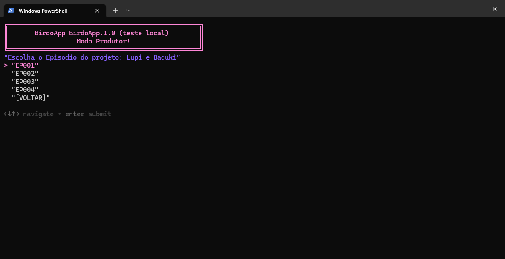

---  
sidebar_position: 2  
title: "Configuração de Projetos" 
description: "Passo-a-passo da configuração de projetos no BirdoApp."
---

> _Passo-a-passo da configuração de projetos no BirdoApp para **produtores / deiretor técinico**._

Cabe aos produtores fazer a configuração dos **Projetos**, **Episódios** e **Cenas** para que apareçam disponíveis para todos os outros do estúdio. Na prática, essas configurações geram os arquivos necessários  para que o BirdoApp apresente os projetos, episódios e cenas disponíveis para os outros perfis.

A interface por onde projetos, episódios e cenas são criados no BirdoApp é acessada executando o próprio BirdoApp no _modo produtor_. A seguir as etapas necessárias para acessar o modo _produtor_ e criar projetos, episódios e cenas.

### 1) Acessando o Modo Produtor

O _Modo Produtor_ é uma interface no terminal que permite ações que não estão disponíveis na interface do BirdoApp. 

Siga os passos a seguir para executar o BirdoApp no modo produtor:

#### a. Abra o programa Powershell;

#### b. Execute os comandos a seguir, cada um seguido pela tecla `ENTER`

```powershell
cd $env:APPDATA\BirdoApp\
```

```powershell
.\venv\Scripts\activate.ps1
```

```powershell
python main.py --produtor
```

### 2) Navegando no Modo Produtor

Após rodar os comandos do [**item 1**](#1-acessando-o-modo-produtor), o terminal vira a interface do modo produtor.


:::tip
    Para navegar, basta usar as setas do teclado para mudar as opções, e apertar 'Enter' para selecionar uma opção
:::

Estas são as opções disponíveis no menu principal do modo produtor:

<details>
  <summary>👉 "Configurar BirdoApp"</summary>

  - Opção para mudar a configuração do BirdoApp. Essa é a mesma [**configuração da interface do BirdoApp**](../../configuracao.md), mas os itens da configuração aparecem no prompt de cada vez. Basta ir apertando enter para ir para o próximo item.

</details>


<details>
  <summary>👉 "Projetos"</summary>

  - Esta opção lista todos projetos existentes no BirdoApp do estúdio configurado. Navegue para selecionar um projeto existente, ou voltar para o menu principal.
  > menu da seleção de projetos:
  
  

  > menu com opções do projeto selecioado:

  
  
  <details>
    <summary>👉 "Episódios / Sequências"</summary>

    - Opção para listar todos ep (ou sequências, dependendo de como você decidir dividir seu projeto).
    > menu para escolher um EP/SQ existente do projeto:

    

    > ao escolher um ep, estas são as opções disponíveis:

    

    * `Importar Animatics`: O ponto de entrada de uma cena no BirdoApp é um arquívo de vídeo com o trecho de animatic daquela cena. Para além de definir os personagens e cenários presentes na cena, a duração desse trecho do animatic também serve de referéncia para a criação das cenas, os arquivos `.xstage` do Harmony.

   A criação das cenas depende de dois processos separados que precisam acontecer em ordem. Primeiro é necessário _apontar os trechos de animatic_ que servirão de base para cada uma das cenas e em seguida é preciso _criar os setups básicos_.
    
    Escolha uma pasta onde contenha somente os arquivos de video com cenas separadas de animatic, e esta opção faz as seguintes ações:
      - Converte todos arquivos para compressão de animatic;
      - Cria uma cópia com a nomenclatura correta na estrutura do projeto;
    
    :::tip
        Esta ação também pode ser feita usando interface, com a funcionalidade ["Uploader"](../../funcionalidades/principais/uploader.md)
    :::
    
    * `Criar Setup Básico`: Uma vez importados os trechos de animatics, um setup básico precisa ser criado para cada cena. O setup básico é o primeiro arquivo de Harmony (`.xstage`) de cada cena e contem as respectivas referências de som e imagem da cena em questão, assim como a duração. A criação do setup básico é feita de forma automática para cada cena que teve um trecho de animatic importado na etapa anterior, ou para um conjunto restrito de cenas selecionadas.

       Depois de criados, os artistas de setup poderam começar a preparar os setups das cenas, selecionando-as pela interface do ["Abrir Cenas"](../../funcionalidades/principais/abrir-cena.md).

  </details> 
  
  <details>
    <summary>👉 "Criar Ep / Sq"</summary>

    - Opção para para Para criar um episódio/sequência novo. Basta inserir o nome do EP/SQ que deseja criar no prompt, e o EP/SQ criado, terá toda estrutura de pastas criadas no servidor do projeto, e estará disponível no item **"Episódios / Sequências"**.

    > As seguintes pastas dos novos episódios serão criadas no servidor: 
    ```
	01_EPISODIOS/
	└─── EPXXX/
	     ├── 01_BOARD/
	     ├── 02_ASSETS/
	     └── 03_CENAS/
	         ├── 00_RENDER/
	         │   ├── 00_ANIMATIC/
	         │   ├── 01_SETUP/
	         │   ├── 02_ANIM/
	         │   └── 03_COMP/
	         ├── 01_SETUP/
	         ├── 02_ANIM/
	         └── 03_COMP/
    ```

  </details> 

 
</details>


<details>
  <summary>👉 "Criar Novo Projeto"</summary>

  - Esta opção configura um projeto novo para o BirdoApp. Nessa ordem, irá apresentar para você cada item da configuração básica de um projeto novo necessário:

    * Defina um prefixo de 3 letras maiúsculas. Ex.: `PRJ`;
    * Defina o nome completo do projeto;
    * Escreva uma breve descrição sobre o projeto;
    * Forneça o caminho da pasta raíz do projeto no servidor;
    * Opcionalmente, forneça o caminho para um arquivo de imagem para servir de ícone do projeto.

</details>


<details>
  <summary>👉 "Sobre"</summary>

  - Mostra informações sobre o BirdoApp, como [créditos](../../creditos.md).

</details>


<details>
  <summary>👉 "Termos Legais"</summary>

  - Mostra os [termos legais](../../termos.md) do BirdoApp.

</details>