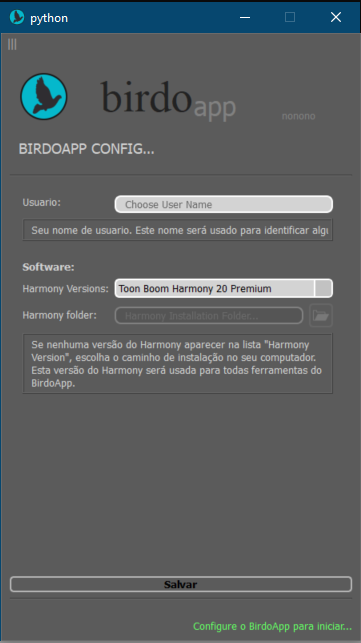
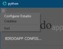
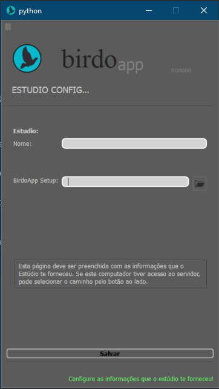

---  
sidebar_position: 1  
title: "Configuração Inicial"  
---

> _Passo-a-passo da configuração inicial do BirdoApp para **produtores**._

Diferente de artistas que trabalham principalmente com o Toon Boom Harmony e que podem querer trabalhar na [modo _standalone_](../../modos-de-uso#modo-standalone) do BirdoApp, produtores estarão trabalhando na [modo _para estúdio_](../../modos-de-uso#modo-estudio). A seguir as etapas necessárias para fazer a configuração inicial do BirdoApp:

### 1) Informações básicas

Abra o BirdoApp pela primeira vez e preencha com suas informações básicas: Nome no campo _Usuario_, versão e diretório de instalação do Harmony nos respectivos campos _Harmony Versions_ e _Harmony folder_. Para os dois últimos, o BirdoApp identifica uma instalação padrão e pré-preenche. Alterar em casos de local de instalação não-padrão, ou mais de uma versão.

:::warning
Você precisa clicar em `Salvar` _antes_ de prosseguir com a configuração de estúdio.
:::

### 2) Configurar Estúdio

Clique no símbolo com três barras verticais `|||` no canto superior esquerdo da janela de configuração do BirdoApp e escolha a opção _Configurar Estúdio_. Preencha os campos _Nome_ e _BirdoApp Setup_ com o nome do estúdio e o caminho da pasta no servidor onde ficarão os arquivos de configuração de *todos* os projetos.

### 3) Fechar

Feche a janela de configuração inicial do BirdoApp. Agora você pode começar a usar o BirdoApp normalmente.
