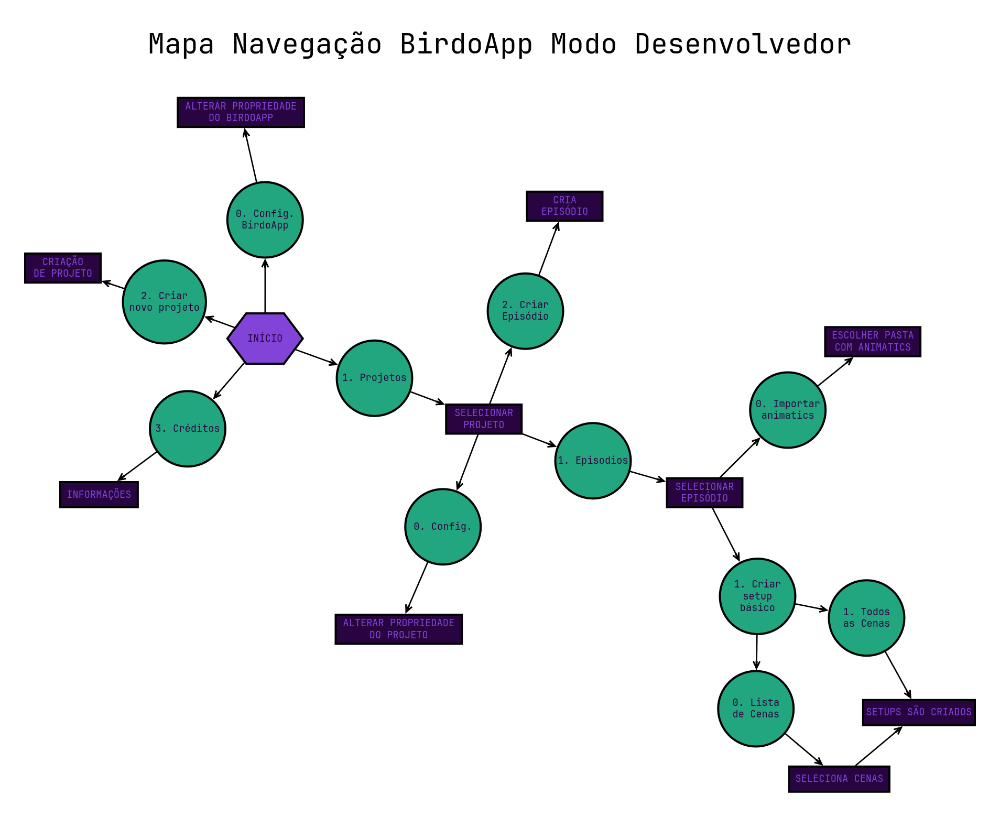
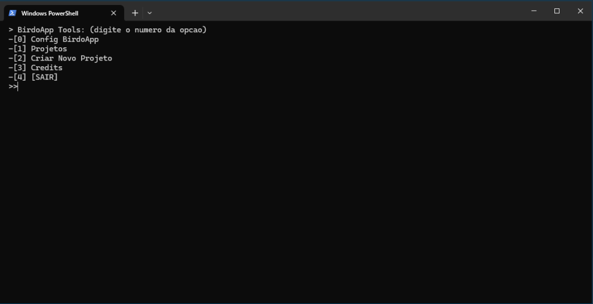

---  
sidebar_position: 2  
title: "Configuração de Projetos" 
---

> _Passo-a-passo da configuração de projetos no BirdoApp para **produtores**._

Cabe aos produtores fazer a configuração dos **Projetos**, **Episódios** e **Cenas** para que apareçam disponíveis para todos os outros do estúdio. Na prática, essas configurações geram os arquivos necessários  para que o BirdoApp apresente os projetos, episódios e cenas disponíveis para os outros perfis.

A interface por onde projetos, episódios e cenas são criados no BirdoApp é acessada executando o próprio BirdoApp no _modo desenvolvedor_. A seguir as etapas necessárias para acessar o modo desenvolvedor e criar projetos, episódios e cenas.

### 1) Acessando o modo desenvolvedor

Siga os passos a seguir para executar o BirdoApp no modo desenvolvedor:

#### a. Abra o programa Powershell;

#### b. Execute os comandos a seguir, cada um seguido pela tecla `ENTER`

```powershell
cd $env:APPDATA\BirdoApp\
```

```powershell
.\venv\Scripts\activate.ps1
```

```powershell
python main.py --dev
```

Na imagem a seguir é possível ver as opções disponíveis no modo desenvolvedor:



### 2) Criando novos projetos

Para criar projetos, episódios e cenas você deve digitar o número da opção desejada.



Para criar um novo projeto, siga as seguintes etapas:

* Tecle `2`, para escolher a opção _Criar Novo Projeto_;
* Defina um prefixo de 3 letras maiúsculas. Ex.: `PRJ`;
* Defina o nome completo do projeto;
* Escreva uma breve descrição sobre o projeto;
* Cole o caminho da pasta raíz do projeto no servidor;
* Opcionalmente, cole o caminho para um arquivo de imagem para servir de ícone do projeto.
 
Em seguida você deve ver mensagens de confirmação e pressionar qualquer tecla para voltar ao menu inicial do Modo Desenvolvedor. Depois disso o projeto vai aparecer disponível para *todos* que tiverem feito [a configuração da variante *de estúdio*](./configuracao-inicial) do BirdoApp.

### 3) Criando episódios

Siga os passos descritos a seguir para criar novos episódios em um projeto:

* Escolha a opção `1`, _Projetos_;
* Selecione um dos projetos criados;
* Seleciona a opção `2`, _Criar EP_;
* Digite os episódios que deseja criar, listados em sequência, ou como um intervalo de números. Ex.: `EP101,EP102,EP103`, ou simplesmente `1-3`.

As seguintes pastas dos novos episódios serão criadas no servidor:

```
/01_EPISODIOS/EPXXX/01_BOARD/
/01_EPISODIOS/EPXXX/02_ASSETS/
/01_EPISODIOS/EPXXX/03_CENAS/
/01_EPISODIOS/EPXXX/03_CENAS/00_RENDER/
/01_EPISODIOS/EPXXX/03_CENAS/00_RENDER/00_ANIMATIC/
/01_EPISODIOS/EPXXX/03_CENAS/00_RENDER/01_SETUP/
/01_EPISODIOS/EPXXX/03_CENAS/00_RENDER/02_ANIM/
/01_EPISODIOS/EPXXX/03_CENAS/00_RENDER/03_COMP/
/01_EPISODIOS/EPXXX/03_CENAS/01_SETUP/
/01_EPISODIOS/EPXXX/03_CENAS/02_ANIM/
/01_EPISODIOS/EPXXX/03_CENAS/03_COMP/
```

### 4) Criando cenas

O ponto de entrada de uma cena no BirdoApp é um arquívo de vídeo com o trecho de animatic daquela cena. Para além de definir os personagens e cenários presentes na cena, a duração desse trecho do animatic também serve de referéncia para a criação das cenas, os arquivos `.xstage` do Harmony.

A criação das cenas depende de dois processos separados que precisam acontecer em ordem. Primeiro é necessário _apontar os trechos de animatic_ que servirão de base para cada uma das cenas e em seguida é preciso _criar os setups básicos_.

#### a) Importar animatics

* Escolha a opção `1`, _Projetos_;
* Selecione um dos projetos criados;
* Escolha a opção `1 Episódios`;
* Selecione um dos episódios criados;
* Escolha a opção `0 Importar animatics`;
* Cole ou digite o caminho da pasta que contém _apenas_ os arquivos com os trechos de animatic, um para cada cena.

#### b) Criar setup básico

Uma vez importados os trechos de animatics, um setup básico precisa ser criado para cada cena. O setup básico é o primeiro arquivo de Harmony (`.xstage`) de cada cena e contem as respectivas referências de som e imagem da cena em questão, assim como a duração. A criação do setup básico é feita de forma automática para cada cena que teve um trecho de animatic importado na etapa anterior, ou para um conjunto restrito de cenas selecionadas, seguindo as etapas abaixo no menu do _modo desenvolvedor_:

* `1 Projetos`;
* Seleciona um projeto;
* `1 Episódios`;
* Seleciona um episódio;
* `1 Criar setup básico`;
* Escolha entre as opções `0 Lista de cenas` ou `1 Todo o episódio`.

Depois de criados, os artistas de setup poderam começar a preparar os setups das cenas, selecionando-as pela interface do OpenScene.
