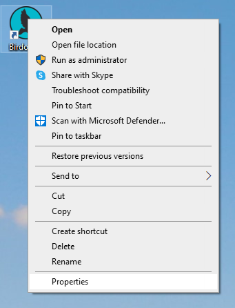
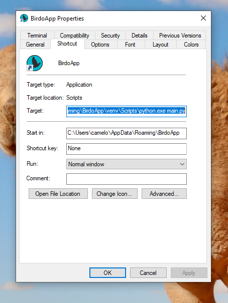
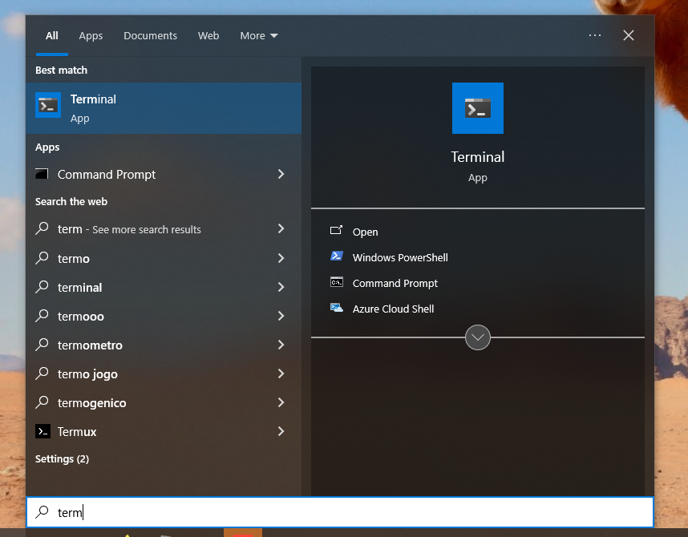
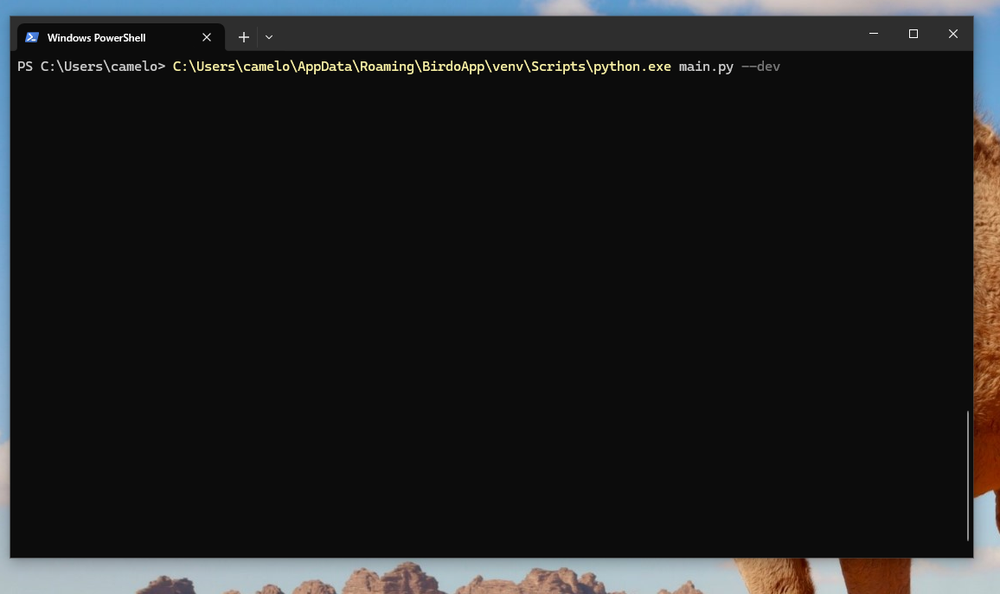

---  
sidebar_position: 2  
title: "Configuração de Projetos" 
---

> _Passo-a-passo da configuração de projetos no BirdoApp para **produtores**._

Todo o trabalho feito através do BirdoApp se enquadra na estrutura `PROJETO` :arrow_forward: `EPISÓDIO` :arrow_forward: `CENA`, conforme visto na [_terminologia_](../../terminologia#projeto). Mas para aparecerem disponíveis para toda a equipe, os projetos, as cenas e os episódios precisam ser adicionados ao BirdoApp.

A interface por onde projetos, episódios e cenas são criados no BirdoApp é acessada executando o próprio BirdoApp no _modo desenvolvedor_. A seguir as etapas necessárias para acessar o modo desenvolvedor e criar projetos, episódios e cenas.

### 1) Acessando o modo desenvolvedor

#### a. Abrindo o Powershell na pasta correta

Para lançar o BirdoApp no modo desenvolvedor será preciso executar uma linha de comando no Powershell (ou Terminal). ***Mas atenção*** :warning:, _o Powershell deverá ser aberto na pasta do BirdoApp_. Para abrir uma janela do Powershell na pasta correta siga os passos a seguir:

##### I - Abra uma janela do Windows Explorer

Isso pode ser feito com o atalho `Tecla Windows` + `e`, ou pelo menu Iniciar.

##### II - Navegue até a pasta do BirdoApp

Navegue até a pasta `C:\Users\<SEU USUÁRIO>\AppData\Roaming\BirdoApp\`, ou simplesmente cole a linha abaixo na barra de endereço do Windows Explorer:

`%APPDATA%\BirdoApp\`

:::tip
O atalho para editar a barra de endereços do Windows Explorer é o `Alt+D` (ou `Ctrl+L`).
:::

##### III - Invoque o Powershell pela barra de endereços

Edite a barra de endereços do Windows Explorer mais uma vez, mas dessa vez escreva apenas _powershell_. Isso vai abrir uma janela do Powershell já na pasta correta. Se você tiver o programa Terminal instalado no seu computador é possivel abrir uma janela clicando com o botão direito do mouse em uma área vazia da pasta e escolher a opção "Abrir no Terminal".

#### b. Copiando o comando do _launcher_

Normalmente o BirdoApp é executado a partir do ícone que é criado na desktop durante a instalação. Esse ícone executa um comando e para executar no modo desenvolvedor esse comando requer um complemento. Clique com o botão direito do mouse no ícone do BirdoApp na desktop e escolha a opção _Propriedades_.



Na janela que aparecer você deve selecionar e copiar todo o texto dentro do campo _Target_.



:::tip
Ao invés de clicar e arrastar o mouse por toda a caixa de texto, você pode clicar uma única vez sobre o texto e utilizar o atalho `Ctrl+A` (selecionar tudo) para selecionar tudo que estiver na caixa de texto.
:::

#### c. Complementando e executando o comando

Abra o programa Powershell (ou Terminal) através do menu iniciar. Cole o comando dentro da janela do programe e complemente com o texto ` --dev` (atenção para o espaço para não colar com o fim do comando copiado).





Alternativamente você pode executar diretamente o comando abaixo em uma janela do Powershell:

```powershell
& $env:APPDATA\BirdoApp\venv\Scripts\python.exe main.py --dev
```

### 2) Criando projetos/episódiso/cenas

Para criar projetos, episódios e cenas você deve digitar o número da opção desejada.


Para criar um novo projeto, siga as seguintes etapas:

* Tecle `2`, para escolher a opção _Criar Novo Projeto_;
* Defina um prefixo de 3 letras maiúsculas. Ex.: `PRJ`;
* Defina o nome completo do projeto;
* Escreva uma breve descrição sobre o projeto;
* Cole o caminho da pasta raíz do projeto no servidor;
* Opcionalmente, cole o caminho para um arquivo de imagem para servir de ícone do projeto.
 
Em seguida você deve ver mensagens de confirmação e pressionar qualquer tecla para voltar ao menu inicial do Modo Desenvolvedor. Depois disso o projeto vai aparecer disponível para *todos* que tiverem feito [a configuração da variante de estúdio](./configuracao-inicial) do BirdoApp.

5) Inicie a interface do BirdoApp e veja o projeto configurado